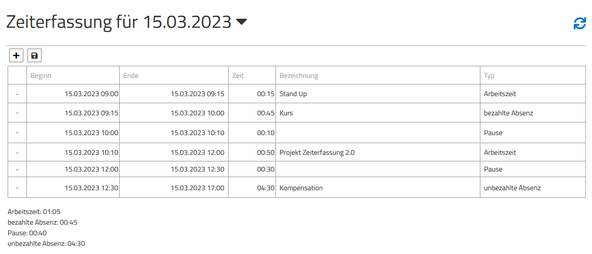

# Bilde deine eigene Zeiterfassung

 

> Das Ziel ist eine einfache Zeiterfassung Fullstack zu entwerfen.
Dabei sollte Schritt für Schritt vorgegangen werden, um einen guten Einblick in die Vorgehensweise aufzuzeigen.

1. Klone/Kopiere dieses Repo in deinen eigenen GitHub Account 
2. Installiere deine bevorzugte Entwicklungsumgebung (Visual Studio, VSCode, JetBrains Rider)
3. Erstelle einen eigenen Branch und codiere Schritt für Schritt deine Lösung

### Features zum Umsetzen:

Ich als User der Zeiterfassung möchte auf einer Seite meine Buchungen sehen und bearbeiten können, um eine einfach Zeiterfassung via Web nutzen zu können.

1. Erstelle ein neues Modell für TimeTracking (Model siehe weiter unten)
2. Das Modell sollte von der InMemory DB via API verfügbar gemacht werden
3. Das Modell sollte mittels CRUD Operationen bearbeitet werden können
4. Erlaube das Hinzufügen, löschen und Bearbeiten von Buchungen via WebUI
5. Erstelle eine übersicht aller vorhandenen Buchungen in einer Tabelle (Design frei wählbar)
   mit Spalten Start, Ende, Zeitmenge (berechnet), Beschreibung, Typ
6. Zeige unterhalb der Tabelle einen Zusammenzug der gesamten Zeitmenge aller Buchungstypen (z.B. aller Working Hours)

Mockup für das UI:

>

### Zusatzinformationen

>Das Projekt verwendet swagger um für die WebUI einen Client zu generieren.
Passt man also die API an, sollte mit NSWAG dies neu generiert werden.
siehe dazu *\src\WebUI\wwwroot\api\specification.json*

>Es ist nicht nötig, Berechtigungen oder Anmeldung für die Anpassungen zu verwenden.
Die neue Ansicht soll in einer eigenen Komponente erstellt werden.

Hinweise für das Datenmodell zur Anzeige:

#### Modell für "*TimeTracking*":
- *Start of Record Date* / Time UTC
- *End of Record* / Time UTC
- *Short Description* / string
- *Type* / int (Referenz zu BookingTypes)

#### Modell für "*BookingTypes*"
- BookingTypeId / int
- Description / string

#### Einträge für *BookingTypes*, mit ID:
- Präsenzzeit (0)
- Pause (1)
- Krankheit oder Unfall (2)
- bezahlte Absenz (3)
- unbezahlte Absenz (4)

 ## verwendetete Technologien

* [ASP.NET Core 7](https://docs.microsoft.com/en-us/aspnet/core/introduction-to-aspnet-core)
* [Entity Framework Core 7](https://docs.microsoft.com/en-us/ef/core/)
* [Angular 14](https://angular.io/)
* [MediatR](https://github.com/jbogard/MediatR)
* [AutoMapper](https://automapper.org/)
* [FluentValidation](https://fluentvalidation.net/)
* [NUnit](https://nunit.org/), [FluentAssertions](https://fluentassertions.com/), [Moq](https://github.com/moq) & [Respawn](https://github.com/jbogard/Respawn)

## Wie starte ich?

1. Installiere [.NET 7 SDK](https://dotnet.microsoft.com/download/dotnet/7.0)
2. Installiere [Node.js LTS](https://nodejs.org/en/)
3. Verwende VSCode, VisualStudio or Jetbrains Rider als Entwicklungsumgebung
4. Starte auch manuell in `src/WebUI` und führe `dotnet run` aus
